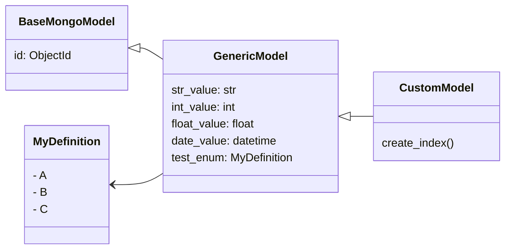
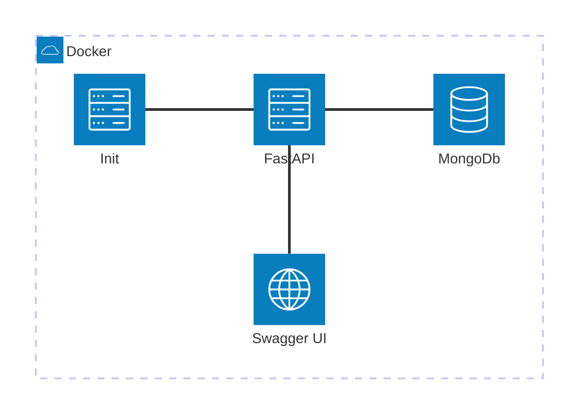

# Quick Overview

In the extended version we now defining custom `Pydantic` models. Also we are extending the setup with a init script to prefill the MongoDB with some data. 

## Models

We are creating a `GenericModel` as well as a `CustomModel` which is inheriting from the `GenericModel`.
The `GenericModel` is inheriting from the `BaseMongoModel` which itself is a `Pydantic`  base model.
Also we are defining a `MyDefinition` enum.

The `CustomModel` is overriding the `create_index` method to create an individual index for the `GenericModel` using the `date_value` + `test_enum` field. With that we are able to query the data more efficiently.

## Architecture

The following component architecture will be created inside a Docker container.
The FastAPI will be accessible via `http://localhost:8000` and the Swagger UI via `http://localhost:8000/docs`.
The access to the MongoDB will be handled by the FastAPI.
In addition we now have a `Init` container which will run once and prefill the MongoDB with some data by calling the FastAPI.

## Endpoints

In this example we will use the defined classes to provide ReadWrite-Endpoints for the `GenericModel` and ManyReadWrite-Endpoints for the `CustomModel` via FastAPI.
