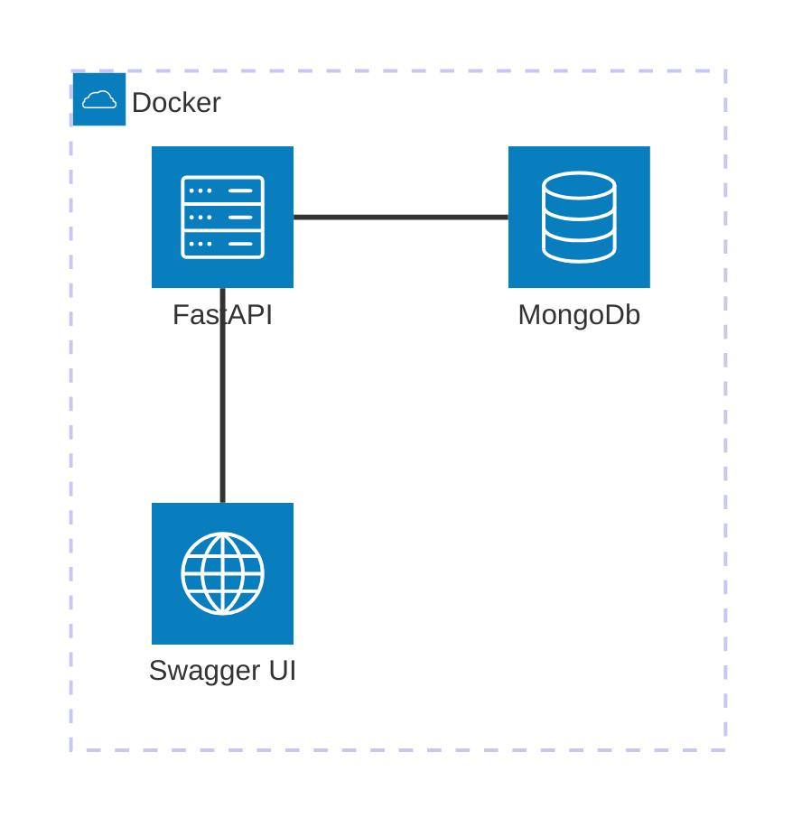

# Quick Overview

This is the easiest way to get started with `pydaadop`.
We are using mostly hard-coded values to create a ReadWrite FastAPI application with a MongoDB backend.
You will be able to access (read / write) the data from the MongoDB using the FastAPI via Swagger UI.

## Architecture

The following component architecture will be created inside a Docker container.
The FastAPI will be accessible via `http://localhost:8000` and the Swagger UI via `http://localhost:8000/docs`.
The access to the MongoDB will be handled by the FastAPI.

## Endpoints

In this example we will use the provided `BaseMongoModel` to create ReadWrite endpoints for the MongoDB via FastAPI.